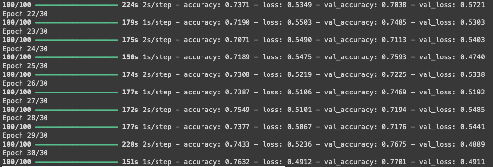
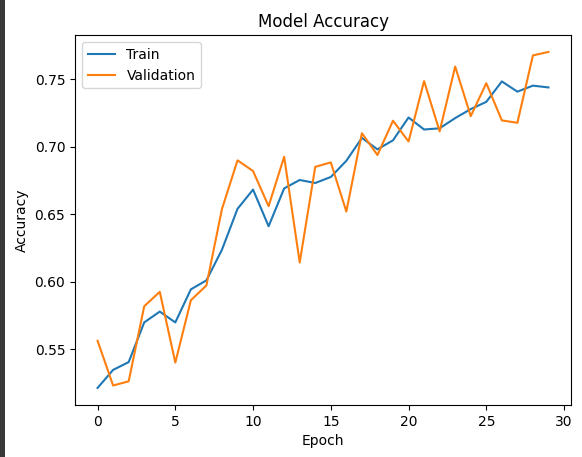
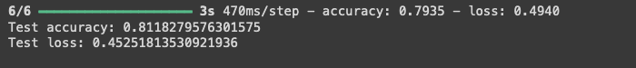

# 說明

## ML 練習:主要功能辨識貓跟非貓的圖片

### 模型說明

Machine learning 部分在 colab 上進行 model 建構並 traning，模型部分使用 Sequential 模型搭建卷積神經網路(CNN)，用以處理圖形輸入並進行二元分類(是貓,不是貓) 
整個模型以 3 個卷積層，3 個池化層，1 個展平層，和 2 個全連接層構築而已。前三個卷積層和池化層負責提取圖像的特徵，後面的全連接層負責利用這些特徵進行分類。 
另外 traning 時僅以 steps_per_epoch=100, epochs=30 設定去跑，以準確率達 76%時便停止訓練，測試集的準確定預測為 81%，理想狀況應以 epochs=100 下去 traning 以提高更高的準確度。 

### Project 安裝指南

1.安裝相關套件：`pip install -r requirements.txt`（或其他安裝步驟）   2.申請 LINE BOT：`https://developers.line.biz/en/`(請存下 LINE_CHANNEL_ACCESS_TOKEN 及 LINE_CHANNEL_SECRET)   3.建立.env 檔案並將 LINE_CHANNEL_ACCESS_TOKEN 及 LINE_CHANNEL_SECRET 輸入   4.使用 Ngrok 搭建臨時通道：`https://dashboard.ngrok.com/`   5.於 LINE bot 中設定 Webhook 網址：`https://上一部獲取的網址/callback/`
